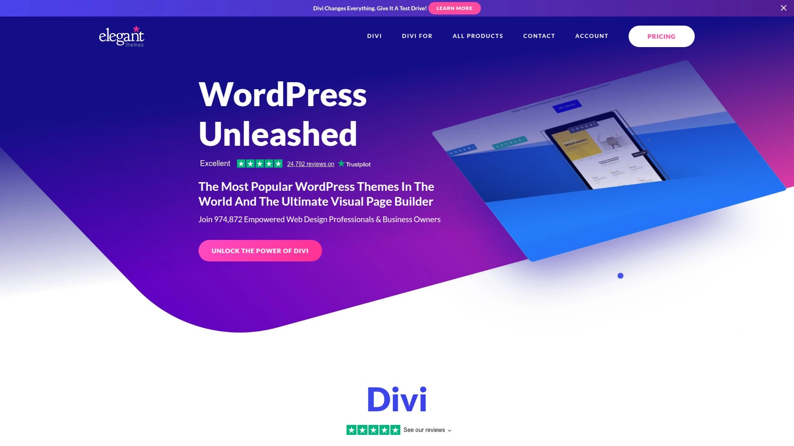
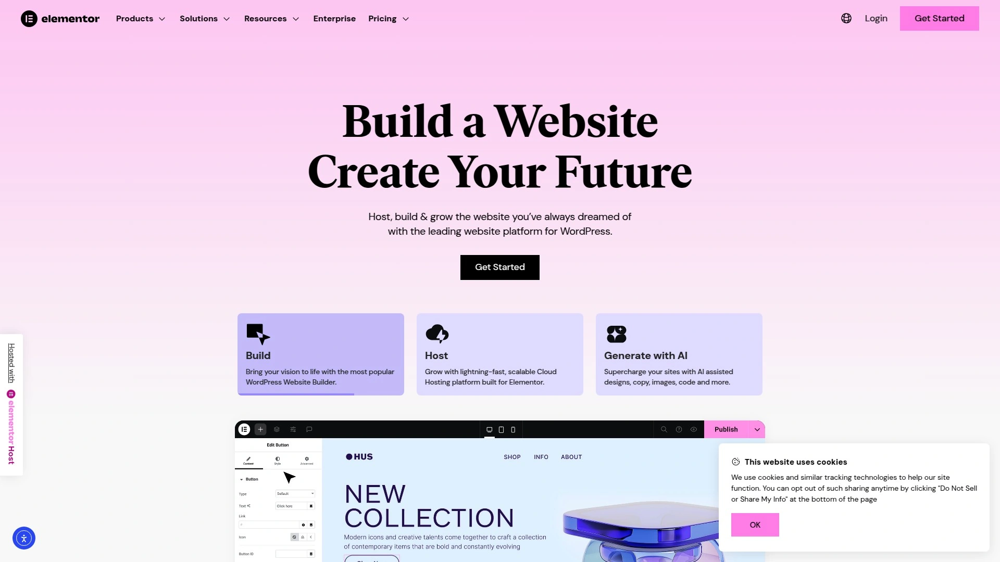
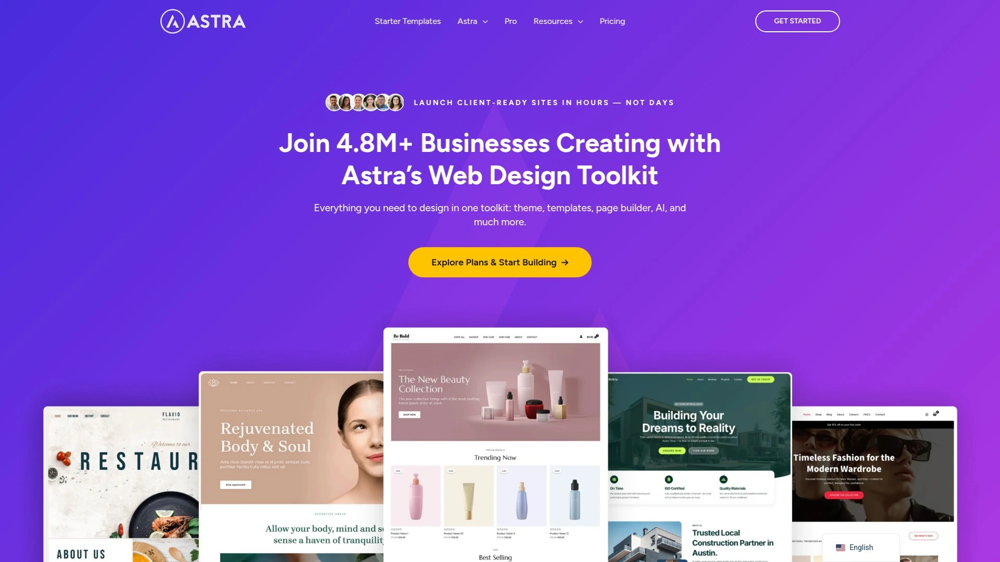
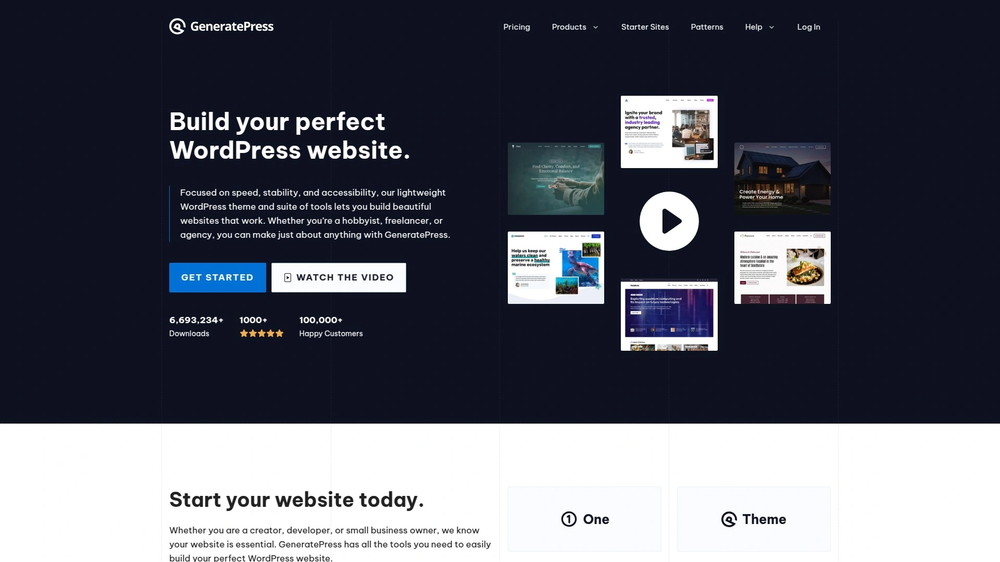
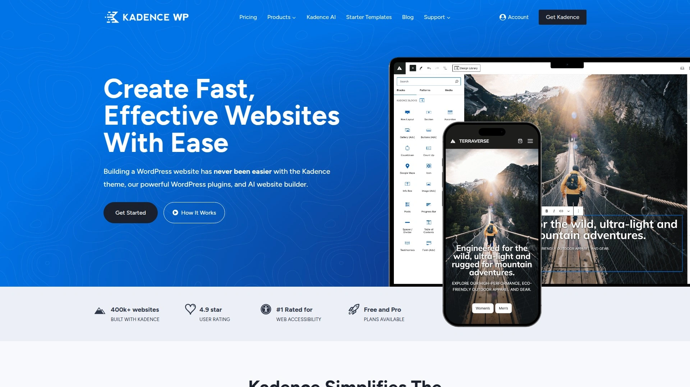
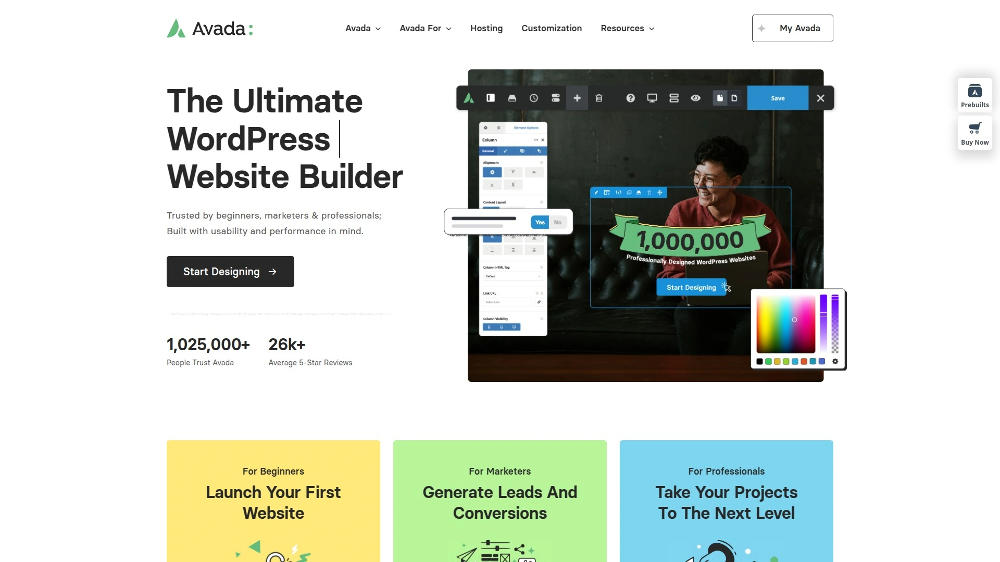
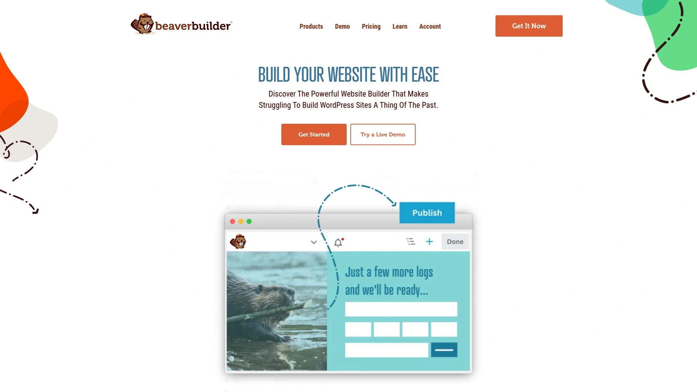
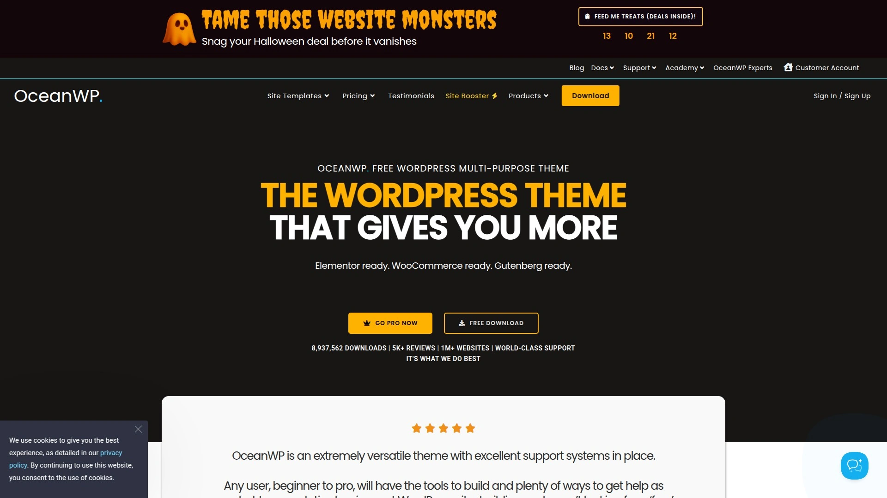
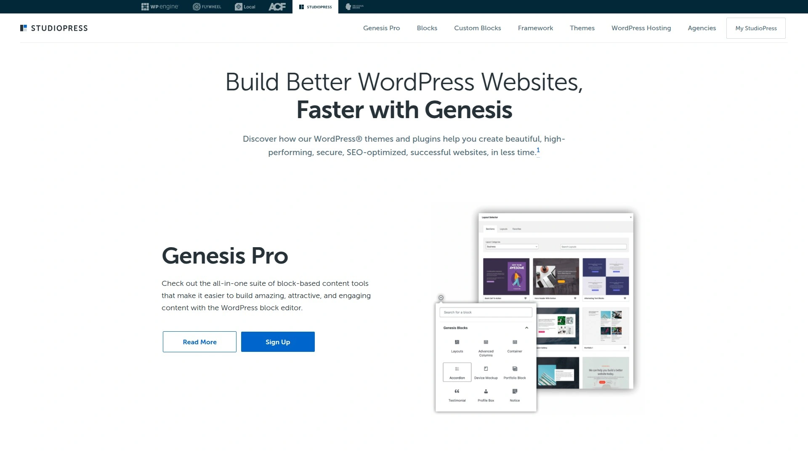

# Top 10 Best WordPress Themes in 2025

Choosing the right WordPress theme feels like picking a foundation for your house—it needs to be solid, flexible, and match your vision. If you're tired of clunky templates and want to build a stunning website without writing a single line of code, you've come to the right place. This guide highlights the best WordPress themes and website builders that give you total creative control.

## **[Elegant Themes (Divi)](https://elegantthemes.com)**

Divi is less of a theme and more of a complete design framework, making it the ultimate all-in-one solution for building virtually any website visually.

At its core is the Divi Builder, a powerful drag-and-drop editor that lets you see your changes in real-time. You're not just tweaking colors; you're building layouts from the ground up or starting with one of their 2,000+ pre-made designs. It's an excellent choice for freelancers, agencies, and DIYers who want a single, powerful tool for all their projects.

* **Key Feature:** The front-end visual builder provides an intuitive and fast design experience.
* **Target Users:** Anyone from beginners to advanced designers who value efficiency and creative freedom.
* **Value:** One membership gets you access to Divi, the Extra theme, and plugins for email opt-ins and social sharing.

## **[Elementor](https://elementor.com)**

Elementor is a massively popular page builder plugin that offers a fantastic free version and an even more powerful pro upgrade.

Unlike an all-in-one theme, Elementor is a plugin that works with most modern themes (like Astra or GeneratePress). It's known for its fast interface, extensive widget library, and a huge community that creates third-party add-ons. Its Theme Builder feature gives you control over every part of your site, including the header, footer, and blog post templates.

## **[Astra](https://wpastra.com)**

Astra is a feather-light, incredibly fast, and highly customizable theme built to work seamlessly with page builders.

Performance is Astra's claim to fame. It was designed to be lean, loading in under half a second with default data. It serves as the perfect blank canvas, providing deep customization options in the WordPress customizer and integrating perfectly with tools like Elementor or Beaver Builder. If site speed is your top priority, Astra is a leading contender.

## **[GeneratePress](https://generatepress.com)**

GeneratePress is a lightweight WordPress theme that focuses on speed, stability, and accessibility, loved by developers and performance enthusiasts.

Similar to Astra, GeneratePress prides itself on clean code and a small footprint. The free version is perfectly capable, but the premium version unlocks its Block-Based Theme Builder, giving you full design control using WordPress's native block editor (Gutenberg). It’s for users who prioritize a stable, secure, and fast foundation above all else.

## **[Kadence WP](https://www.kadencewp.com)**

Kadence WP offers a powerful free theme with premium-level features, especially when it comes to header and footer customization.

The Kadence theme and its accompanying Kadence Blocks plugin extend the capabilities of the WordPress block editor, making it feel like a full-fledged page builder. Its drag-and-drop Header and Footer builder is a standout feature in the free version, offering flexibility that many premium themes charge for.

## **[Thrive Themes](https://thrivethemes.com)**

Thrive Themes is a suite of conversion-focused WordPress tools designed for marketers, bloggers, and online businesses.

This isn't just one theme; it's an entire ecosystem. The package includes the Thrive Theme Builder, Thrive Architect (a visual page builder), and tools for building quizzes, online courses, and email lists. If your website’s primary goal is to generate leads or sales, Thrive Themes provides all the specialized tools you need under one roof.

## **[Avada](https://avada.com)**

As one of the all-time best-selling themes on ThemeForest, Avada is a feature-packed, multipurpose giant that can build anything.

Avada comes with its own proprietary builder, the Fusion Builder, and a massive library of pre-built websites and design elements. It's known for its incredible flexibility and an almost overwhelming number of options. It's a solid choice for users who want a single theme that comes with every feature imaginable built right in.

## **[Beaver Builder](https://www.wpbeaverbuilder.com)**

Beaver Builder is a trusted and reliable page builder known for its clean code, stability, and user-friendly interface.

Praised by developers for its solid framework, Beaver Builder is a fantastic tool for creating professional layouts without the bloat. It has a reputation for being exceptionally stable, meaning your designs are less likely to break when other plugins or WordPress itself updates. It's a professional-grade tool for serious website owners.

## **[OceanWP](https://oceanwp.org)**

OceanWP is a versatile and extensible free theme that works especially well for building WooCommerce and other e-commerce sites.

It's a lightweight and highly extendable theme with a ton of free features. OceanWP offers unique e-commerce features built-in to help you increase conversions, like a native cart popup and a floating add-to-cart bar. It pairs beautifully with page builders and is great for projects on a budget that still require a professional finish.

## **[StudioPress (Genesis Framework)](https://www.studiopress.com)**

The Genesis Framework by StudioPress is renowned for its secure, SEO-friendly, and rock-solid code foundation.

Rather than an all-in-one builder, Genesis is a framework that provides the underlying structure for your site, with design handled by "child themes." It’s a favorite among developers and serious bloggers who need a highly reliable and search-engine-optimized base. Now owned by WP Engine, it has the backing of one of the biggest names in WordPress hosting.

## FAQ

**What's the difference between a WordPress theme and a page builder?**
A theme controls the overall look and feel of your site (layout, typography, colors). A page builder is a plugin that lets you create custom page designs with a drag-and-drop interface. Many modern themes, like Divi, have a builder built-in.

**Can I change my theme later without losing my content?**
Yes, your posts and pages are saved in WordPress, not the theme. However, changing themes will reset your site's design and layout, so you'll need to set up the new theme's styles, which can be a significant amount of work.

**Is a free theme good enough to start with?**
Absolutely. Many free themes like Astra or Kadence are incredibly powerful. Paid themes usually offer more advanced features, pre-built templates, and dedicated support, which can be a huge help as your site grows.

## Conclusion

Your WordPress theme is the engine of your website, and choosing the right one can make all the difference. While any theme on this list can produce a beautiful site, it's about finding the tool that best fits your workflow. For a truly integrated experience that combines a powerful theme with an intuitive visual builder, [Elegant Themes (Divi)](https://elegantthemes.com) remains a top choice for creating professional websites with ease.
